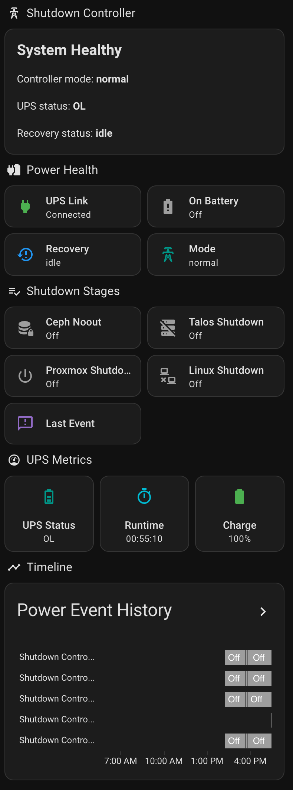

# Proxmox Shutdown Controller

This module deploys a small Proxmox LXC that coordinates graceful shutdown steps during a UPS event.

It is designed to run outside the Kubernetes cluster it protects, so it can keep operating while the cluster is degraded or shutting down.

The container is bootstrapped through a Proxmox hook script and prepared with:

- `kubectl` for Kubernetes and Ceph toolbox access
- `talosctl` for graceful shutdown of Talos nodes
- `mosquitto_pub` via `mosquitto-clients` for optional MQTT status and event publishing
- `nut-client` for UPS status polling against an existing NUT server
- optional kubeconfig and talosconfig files
- an environment file with Ceph, NUT, Talos, Linux, and Proxmox targets
- a built-in staged controller script with an optional override and matching systemd services

The default controller stages shutdown actions based on the reported UPS runtime:

- set Ceph `noout`
- shut down Talos nodes
- shut down generic Linux nodes over SSH
- shut down selected Proxmox nodes

Use `controller_script` only when you need to replace that built-in flow.

At a glance:

- `node_name` selects the Proxmox host for the LXC
- `pve_connection` is used by Terraform to create the container
- `pve_api` is optional and is only passed into the container if the runtime shutdown flow needs to call the Proxmox API

## Usage

```hcl
module "shutdown_controller" {
  source = "git::https://github.com/friedcircuits/terraform-modules.git//modules/proxmox/shutdown-controller?ref=v0.1.0"

  name      = "shutdown-controller"
  node_name = "pve-node-1"
  vm_id     = 1400

  container_template = {
    url          = "http://download.proxmox.com/images/system/debian-13-standard_13.1-2_amd64.tar.zst"
    datastore_id = "local"
    type         = "debian"
  }

  root_public_keys = [file("~/.ssh/id_ed25519.pub")]

  kubeconfig_content  = var.kubeconfig_content
  talosconfig_content = var.talosconfig_content

  ceph = {
    namespace        = "rook-ceph"
    tools_deployment = "rook-ceph-tools"
  }

  nut = {
    server_host = "192.0.2.10"
    ups_name    = "ups-main"
  }

  mqtt = {
    host             = "mqtt.internal.example"
    topic_prefix     = "homelab/shutdown-controller"
    discovery_prefix = "homeassistant"
  }

  controller_environment = {
    DRY_RUN                                = "true"
    POLL_INTERVAL_SECONDS                  = "15"
    STATUS_LOG_INTERVAL_SECONDS            = "0"
    MQTT_DISCOVERY_REPUBLISH_INTERVAL_SECONDS = "300"
    NOOUT_MIN_RUNTIME_SECONDS              = "1800"
    TALOS_SHUTDOWN_MIN_RUNTIME_SECONDS     = "1200"
    LINUX_SHUTDOWN_MIN_RUNTIME_SECONDS     = "1100"
    PROXMOX_SHUTDOWN_MIN_RUNTIME_SECONDS   = "900"
  }

  talos_nodes   = ["talos-node-1", "talos-node-2", "talos-node-3"]
  linux_shutdown_targets = [
    {
      name = "edge-worker-1"
      host = "edge-worker-1"
      user = "automation"
    }
  ]
  proxmox_nodes = ["pve-node-2"]

  linux_shutdown_ssh = {
    private_key_content      = var.shutdown_controller_ssh_private_key
    strict_host_key_checking = "accept-new"
    user                     = "automation"
  }

  pve_connection = {
    endpoint     = "https://pve.example.com:8006"
    api_user     = "terraform@pam"
    api_password = var.proxmox_password
  }

  pve_api = {
    endpoint     = "https://pve-api.example.com:8006/api2/json"
    api_user     = "automation@pve"
    api_password = var.proxmox_password
  }

  enable_controller_service = true
}
```

## Notes

- Use this outside Kubernetes so the coordinator does not depend on the cluster it may need to shut down.
- `nut-client` is installed so the coordinator can poll the existing NUT server. The built-in controller uses authenticated `upsd` queries when `nut_credentials` are provided, and falls back to `upsc "$NUT_TARGET"` only when no credentials are configured.
- The controller defaults to dry-run mode. Use `controller_environment` to set `DRY_RUN=false` and tune the runtime thresholds once the shutdown flow is ready.
- `STATUS_LOG_INTERVAL_SECONDS` defaults to `0`, which logs UPS status changes only. Set it to a positive value if you want a periodic heartbeat for unchanged status.
- The built-in controller writes to `/var/log/shutdown-controller.log` by default because this has been more reliable than journald or the Proxmox LXC console.
- When `mqtt` is configured, the controller publishes retained controller state to `<topic_prefix>/state`, keeps a compatibility copy at `<topic_prefix>/status`, publishes transient event messages to `<topic_prefix>/event`, and publishes Home Assistant MQTT discovery topics by default.
- Home Assistant discovery is retried periodically, not just once at startup. This avoids missing discovery when the broker or network is not ready during boot.
- Ceph actions are expected to run through Kubernetes, for example via `kubectl -n rook-ceph exec deploy/rook-ceph-tools -- ceph ...`.
- `talos_nodes` entries are passed directly to `talosctl -n`. Hostnames work as long as the controller container can resolve and reach them. IPs avoid a DNS dependency, but only make sense when those node addresses are stable. Use whichever identifier is more reliable in your environment during an outage.
- `linux_shutdown_targets` are shut down over SSH and default to `sudo systemctl poweroff`. Each target can override `user`, `port`, or `command` individually.
- `linux_shutdown_ssh` injects the SSH private key and optional known_hosts data used for generic Linux shutdown targets. `strict_host_key_checking` defaults to `accept-new`; use `yes` when you want to pin host keys explicitly.
- The built-in controller stages Ceph `noout`, Talos shutdown, generic Linux shutdown, and Proxmox shutdown based on runtime thresholds. Override `controller_script` only when you need different behavior.
- `LINUX_SHUTDOWN_MIN_RUNTIME_SECONDS` lets you place generic Linux shutdown before or after Talos and Proxmox actions depending on what you want to keep alive longest during an outage.
- The module also installs a one-shot `shutdown-controller-recovery.service` by default. It runs on LXC boot, waits for line power and healthy Ceph, then unsets `noout` safely.
- Omit `pve_api` entirely if the controller does not need to make Proxmox API calls from inside the container.

## Recovery

Recovery is intentionally separate from the long-running UPS poller.

- `shutdown-controller.service` handles outage detection and staged shutdown actions.
- `shutdown-controller-recovery.service` handles post-boot recovery and `ceph osd unset noout`.

This keeps recovery as a one-time post-boot action instead of trying to fold it into the outage loop.

The recovery service will only unset `noout` when all of these are true:

- the LXC has booted and the one-shot recovery service is running
- the UPS is no longer on battery, when NUT is configured
- Ceph access through the toolbox is working
- Ceph reports `HEALTH_OK`, by default

Relevant environment knobs:

- `RECOVERY_CHECK_INTERVAL_SECONDS`: how often the recovery service retries checks, default `30`
- `RECOVERY_MAX_WAIT_SECONDS`: how long the recovery service waits before giving up and leaving `noout` set, default `1800`
- `RECOVERY_REQUIRE_HEALTH_OK`: whether to require `HEALTH_OK` before unsetting `noout`, default `true`
- `MQTT_DISCOVERY_REPUBLISH_INTERVAL_SECONDS`: how often retained Home Assistant discovery configs are re-published when discovery is enabled, default `300`; set `0` to disable periodic re-publish after the initial attempt

## Sensitive Inputs

Sensitive values can come from whatever secret workflow you already use with Terraform or OpenTofu, such as SOPS, Vault, environment variables, or another secret manager.

Common sensitive inputs:

- `kubeconfig_content`
- `talosconfig_content`
- `nut_credentials`
- `mqtt_credentials`
- `linux_shutdown_ssh`
- `pve_api`
- `pve_connection`

Example optional NUT credential shape:

```hcl
nut_credentials = {
  username = "upsuser"
  password = var.nut_password
}
```

Example optional MQTT configuration shape:

```hcl
mqtt = {
  host                = "mqtt.internal.example"
  port                = 1883
  topic_prefix        = "homelab/shutdown-controller"
  client_id           = "shutdown-controller"
  retain_status       = true
  discovery_prefix    = "homeassistant"
  enable_ha_discovery = true
}

mqtt_credentials = {
  username = "mqtt-user"
  password = var.mqtt_password
}
```

MQTT topic behavior:

- `<topic_prefix>/state`: retained JSON snapshot of controller-specific state for Home Assistant and other consumers
- `<topic_prefix>/status`: retained compatibility copy of the same JSON payload
- `<topic_prefix>/event`: transient JSON event stream for actions, recovery, warnings, and startup
- `<discovery_prefix>/.../config`: retained Home Assistant MQTT discovery payloads for the controller device and entities

Home Assistant discovery entities include:

- UPS connected
- On battery
- UPS status
- UPS runtime seconds
- UPS runtime (formatted)
- UPS charge
- Controller mode
- Ceph noout set
- Talos shutdown started
- Linux shutdown started
- Proxmox shutdown started
- Recovery status
- Last event

If your broker allows anonymous publish, omit `mqtt_credentials` entirely.

The raw runtime sensor is still published for automations and debugging, but it is marked disabled by default in Home Assistant discovery so the formatted runtime is the one that shows up out of the box.

## Home Assistant Examples

Reference Home Assistant YAML is included in [examples/home-assistant/README.md](examples/home-assistant/README.md).

- [examples/home-assistant/automations.yaml](examples/home-assistant/automations.yaml)
- [examples/home-assistant/package.yaml](examples/home-assistant/package.yaml)
- [examples/home-assistant/dashboard.yaml](examples/home-assistant/dashboard.yaml)

Example dashboard:


